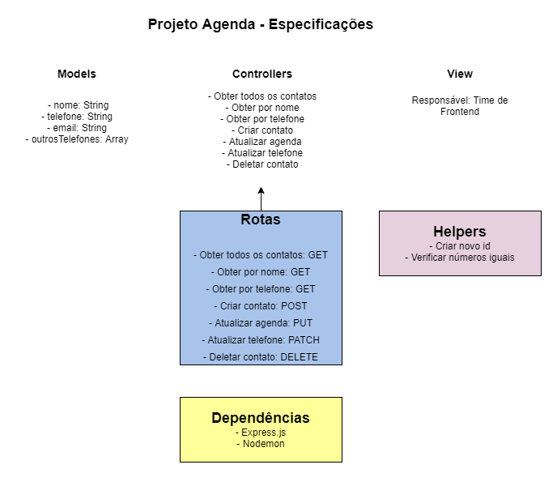

# Projeto Agenda

O projeto é destinado a criar uma API para criação de contatos para uma agenda telefônica, bem como, deletar, visualizar todos ou apenas um e atualizar contatos, utilizando boas práticas e estrutura de pastas, seguindo o design MVC.

# Motivação

Colocar em prática os verbos patch e put que aprendemos hoje e demonstrar que podemos replicar/fixar o aprendizado.

# Ferramentas utilizadas

- Nodejs
- Expressjs
- VSCode
- Nodemon
- Postman

